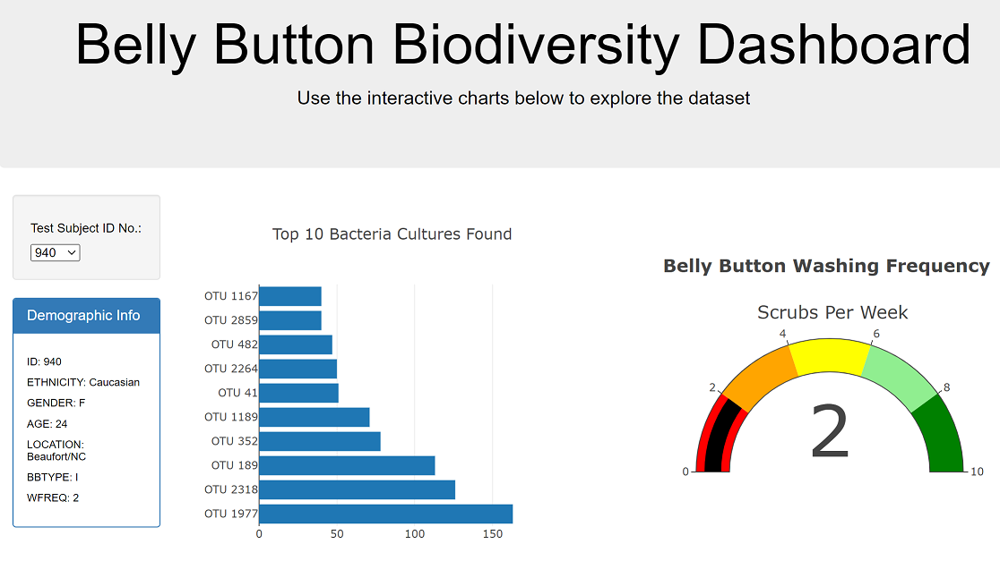
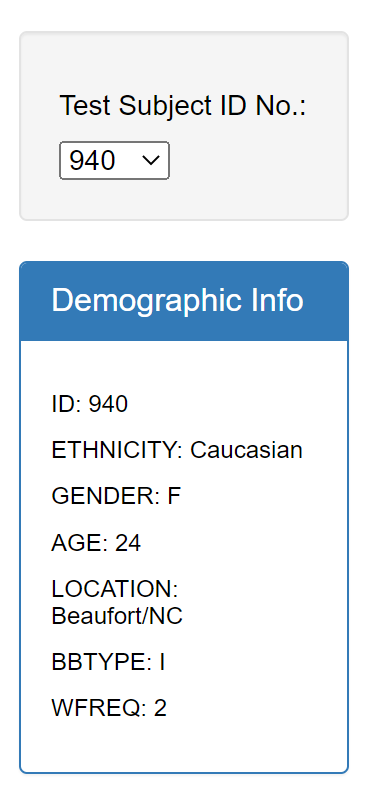
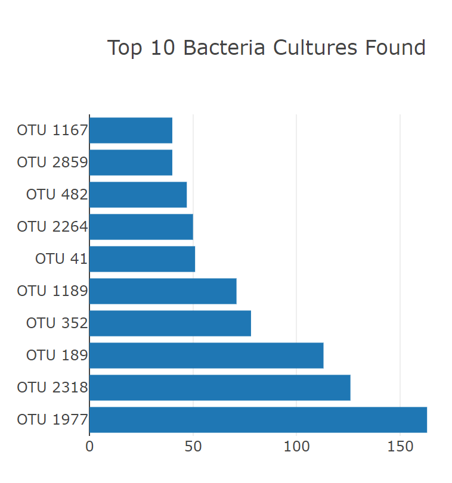
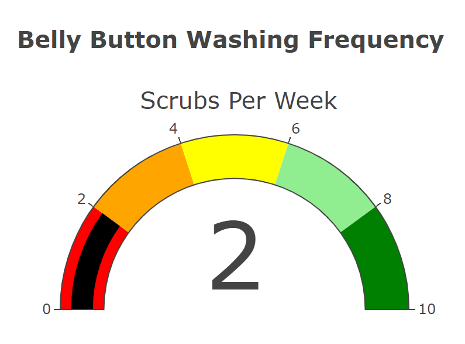
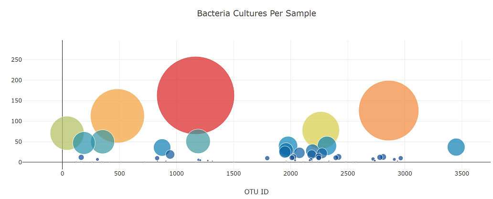

# Plotly_Deployment

## Objective

Create an interactive dashboard exploring the Belly Button Biodiversity catalogging the microbes that colonize in human navels.

## Website

[Bellybutton Biodiversity](https://smgs2022.github.io/Plotly_Deployment/)

## Results

### User Vizualization Upon Site Load

### Userfriendly Dropdown Menu

### OTU Bar Chart

- The y values are the otu_ids in descending order
- The x values are the sample_values in descending order
- The hover text is the otu_labels in descending order

### Frequency Guage Chart

-  Creates the ranges for the gauge in increments of two, with a different color for each increment
- Adds the washing frequency value on the gauge chart
- The indicator shows the level for the washing frequency on the gauge
- The gauge fits in the margin of the element

### Bubble Chart

- The text for a bubble is shown when hovered over
